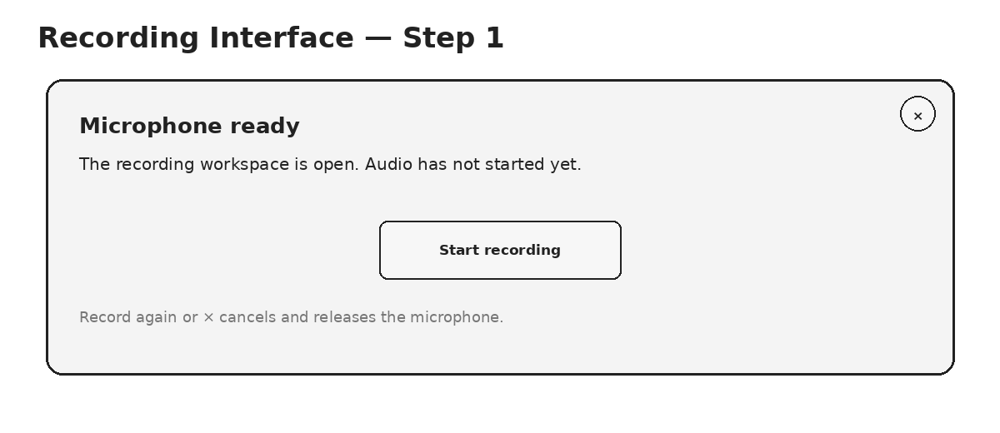
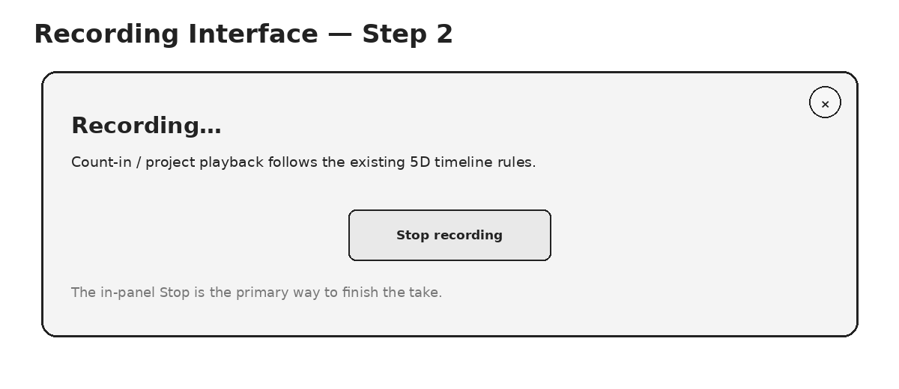
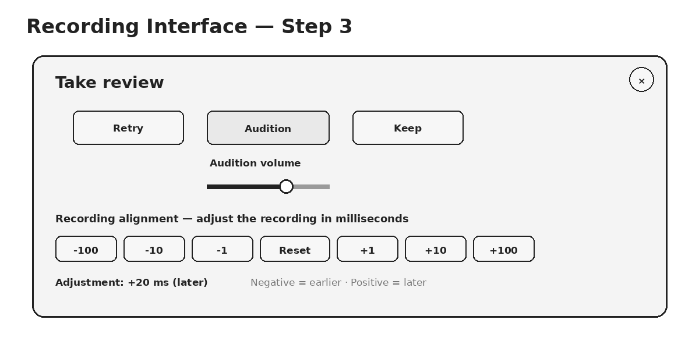
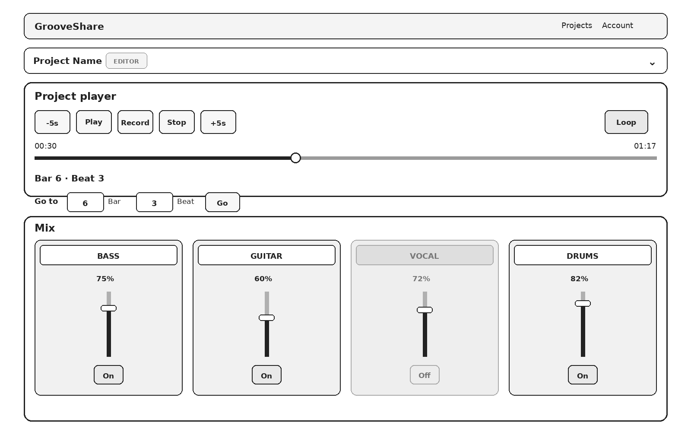
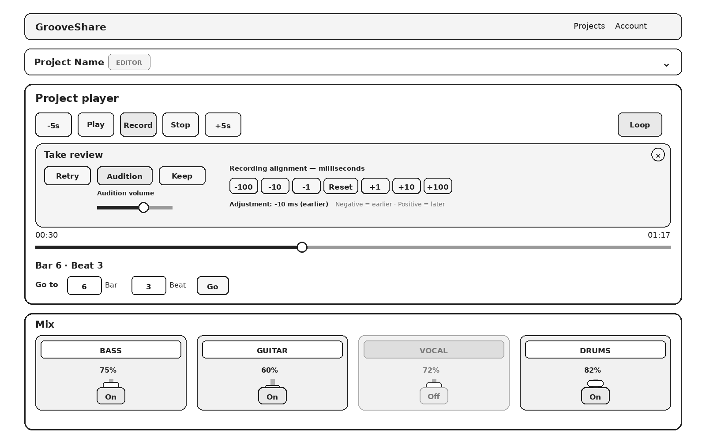

# GrooveShare Project Player / Recording UX Plan

**Status:** design/implementation plan only — no application code is included in this package.

This document translates the supplied sketches into a concrete implementation plan for the next Project Player / recording UX pass. It also incorporates two additional requirements:

1. **Reverse the user-facing alignment sign convention:** positive values move the recording **later**; negative values move it **earlier**.
2. **Remove raw decimal beat values from status messages:** musical position text should use a shared whole-beat Bar/Beat formatter. GrooveShare will not display or expose subdivisions smaller than the individual beat in this UI.

The source sketches are preserved in `source-sketches/`. Clean wireframes based on those sketches are in `wireframes/`.

---

## 1. Overall intent

The Project Player should become a compact, easy-to-scan rehearsal workspace. When Project Details is collapsed, the user should be able to see the transport, recording workflow, position controls, and mix channels with as little vertical scrolling as practical.

The page hierarchy will be:

1. Navigation
2. Collapsible Project Details
3. Project Player / transport
4. Recording Interface, only while the recording workflow is open
5. Seek / musical-position controls
6. Simplified mix channel slots

The recording workflow remains built on the shared 5D recording/timeline behavior. This redesign changes how the workflow is presented and controlled; it should not reintroduce separate desktop/mobile recording semantics.

---

## 2. Project Details: collapsible compact header

When expanded, Project Details can continue to show the normal project metadata and actions.

When collapsed, the box should show only:

- project name
- current user's project-permission badge
- a clear expand/collapse affordance

The collapsed state is specifically intended to reclaim vertical space so the transport and mix are visible together.

The supplied sketches do not explicitly state whether the box should be collapsed by default on first load. The implementation should preserve that as an explicit product decision rather than silently coupling it to the recording state.

---

## 3. Main Project Player controls

The main transport row will be simplified and visually grouped:

`-5s` · `Play` · `Record` · `Stop` · `+5s` · `Loop`

### Record button

- The main Record button uses a microphone icon.
- It replaces the separate “Enable Microphone” action in the normal user flow.
- Pressing Record while the recording interface is closed:
  - acquires/enables the microphone
  - opens the Recording Interface
  - does **not** immediately start the take
- Pressing Record again cancels the recording workflow and releases the microphone.
- The Recording Interface also has an `×` close/cancel affordance.

The close/cancel behavior must respect the durable-draft protections added in 5D. Once a stopped take exists, closing the UI must not silently destroy an auditionable/recoverable take.

### Loop

Loop moves into the main transport row, to the right of the primary playback controls.

Its selected state should be visually obvious (“glow”/highlight in the final visual system), but its state cannot be communicated by color alone; the accessible selected state should also be exposed semantically.

---

## 4. Custom seek control + live musical feedback

The ordinary browser range appearance will be replaced by a custom-styled seek slider consistent with the sketches.

The seek area shows:

- elapsed time
- total project duration
- filled/unfilled progress
- draggable thumb
- musical-position status directly below it

Existing live-seek behavior remains important:

- while dragging, the displayed Bar/Beat position updates immediately
- authoritative transport movement is committed at the appropriate seek interaction boundary
- playback timing remains owned by the shared transport rather than by UI timers

---

## 5. Musical-position formatting: whole beats only

Raw beat decimals should no longer appear in normal status text, including messages shown while auditioning a take.

GrooveShare is not going to expose subdivisions smaller than the individual beat in this UI. A **single shared formatter** should therefore convert any fractional beat position to the containing whole beat by discarding the fractional portion rather than rounding to another beat.

Examples of intended presentation:

- `Bar 6 · Beat 3.0` → `Bar 6 · Beat 3`
- `Bar 6 · Beat 3.25` → `Bar 6 · Beat 3`
- `Bar 6 · Beat 3.5` → `Bar 6 · Beat 3`
- `Bar 6 · Beat 3.75` → `Bar 6 · Beat 3`

The formatter should never display fractional glyphs, decimal beat values, or subdivision notation in this Project Player / recording workflow.

This formatter should be used consistently for:

- Project Player position status
- live seek feedback
- Go-to feedback
- recording start-position messages
- count-in/recording status where position is included
- stopped-take / audition status
- Retry status
- restored-draft status
- any other user-facing Bar/Beat message

The underlying timeline can remain higher precision internally. This is a user-facing presentation rule, not a change to AudioContext timing or timeline math.

---

## 6. Go to Bar + Beat

The explicit Go controls remain directly beneath the main position display.

The compact form is:

`[ Bar value ] Bar   [ Beat value ] Beat   [ Go ]`

Behavior:

- Bar and Beat are both user-editable.
- The Beat input accepts whole beats only; subdivision/decimal beat entry is not part of this UI.
- Beat defaults naturally to Beat 1 when only a bar-level location is intended.
- Pressing Go updates the sticky working anchor.
- The 5D invariant remains: Record, Stop Recording, Audition, Retry, Keep, track refresh, and mix reload do not reset that anchor.
- Project Player **Stop** is the explicit action that resets the anchor to project start.

---

## 7. Recording Interface state machine

The Recording Interface appears inside the Project Player only while the recording workflow is open.

### Step 1 — microphone ready / Start

After the user presses the main Record button:

- microphone is acquired
- the recording panel appears
- the take has not started yet
- a simple **Start recording** button is presented
- `×` or pressing the main Record button again cancels and releases the microphone

Pressing Start enters the existing 5D recording sequence: device preparation where needed, count-in when required, authoritative playback start, and capture.

### Step 2 — actively recording

While capture is active:

- the panel clearly says **Recording…**
- a single prominent **Stop recording** button ends the take
- the panel remains visually simple; no review/alignment controls are shown yet

### Step 3 — stopped take / audition review

After Stop:

Primary actions:

- **Retry**
- **Audition**
- **Keep**

Additional review controls:

- an audition-volume slider beneath/adjacent to Audition
- recording-alignment controls
- the currently persisted alignment value

The audition volume is a **review control for the pending take**. Unless separately specified later, it should not silently redefine the kept project's track volume.

Pressing Keep opens a confirmation modal that lets the user:

- enter/confirm the track name
- confirm keeping the take

Keep must preserve the pending take's musical start, structural media lead-in, and reviewed alignment exactly.

---

## 8. Alignment sign convention: positive = later, negative = earlier

The alignment direction will be changed consistently across the UI, shared domain model, playback math, pending-take state, and persisted track data:

- **negative milliseconds → move recording earlier**
- **positive milliseconds → move recording later**

Compact controls:

`-100  -10  -1  Reset  +1  +10  +100`

The interface should make the direction unmistakable. Example:

`Adjustment: -20 ms (earlier)`

or:

`Adjustment: +30 ms (later)`

The shared semantic should be simple and uniform: **positive means later everywhere**. The implementation should not preserve a reversed internal/storage convention behind the UI.

### No legacy compatibility layer

Existing saved projects and tracks do not need to be preserved for this sign-convention change. They will be deleted and reuploaded.

Therefore:

- do not add a compatibility layer for old alignment offsets
- do not add a migration whose purpose is to negate existing saved alignment values
- do not add legacy sign-detection logic
- newly created/reuploaded tracks should simply use the new sign meaning from the start

Tests should verify the new convention directly for newly recorded and newly persisted takes.

---

## 9. Simplified mix channel slots

Each visible track slot becomes a minimal channel strip.

The normal slot shows only:

- track name
- volume percentage
- custom volume slider
- enable/on-off control

It does **not** show the always-on timing/detail fields that currently make the mix visually dense.

Enabled state:

- track-name area visually active
- enable control visually active
- track participates in playback

Disabled state:

- track-name area grayed/de-emphasized
- enable control grayed/de-emphasized
- track does not participate in playback

The enable state must also be represented semantically for accessibility; color is supplemental feedback, not the only indicator.

Imported stereo tracks and recorded mono tracks retain their existing audio-channel behavior. This UI redesign does not change the shared audio-routing rules.

---

## 10. Whole-page wireframes

### Collapsed Project Details, no Recording Interface

This represents the normal compact Project Player state:

- navigation
- collapsed Project Details
- transport
- custom seek slider
- Bar/Beat status
- Go-to Bar + Beat
- simplified mix slots

The goal is to keep the useful rehearsal controls in one viewport where screen size permits.

### Collapsed Project Details, stopped-take audition phase

The same compact page with the stopped-take review panel displayed inside the Project Player.

The recording panel expands the player only while it is needed; the rest of the page hierarchy remains stable.

---

## 11. Recording-interface close and recovery rules

The new `×` affordance must not undo the recovery work completed in 5D.

Planned behavior by state:

- **Microphone ready, no take exists:** close/cancel releases microphone and closes panel.
- **Actively recording:** cancel behavior must stop the capture safely; destructive discard should be explicit.
- **Stopped take exists:** closing the visible panel must not silently erase the durable pending-take draft. The user should either retain the recoverable draft or make an explicit discard decision.

A browser reload/background suspension should continue to restore:

- sticky Bar/Beat anchor
- stopped pending take
- take alignment
- take media lead-in
- take musical start

The new visual workflow is layered on top of those guarantees rather than replacing them.

---

## 12. Shared architecture plan

### `frontend-core`

Owns shared workflow/domain behavior:

- recording workflow state transitions
- sticky musical anchor
- alignment direction semantics
- alignment preservation on Keep
- Bar/Beat position representation
- shared whole-beat musical-position display formatter
- recording/take invariants

### `frontend-browser`

Owns browser/device mechanics:

- microphone acquisition/release
- MediaRecorder
- Web Audio audition/playback adapter behavior
- IndexedDB pending-take durability
- file picker behavior
- browser range/input mechanics where applicable

### desktop/mobile clients

Own presentation:

- Project Player layout
- collapsible Project Details
- transport visuals
- recording-panel rendering
- custom slider styling
- responsive layout

Desktop and mobile should render the same workflow state rather than implementing separate recording rules.

---

## 13. Test plan before implementation is considered complete

### Workflow/invariant tests

- Record opens the recording workspace without starting capture.
- Start begins the existing count-in/record sequence.
- Stop produces one pending take.
- Retry preserves sticky start position.
- Keep preserves exact alignment, media lead-in, and musical placement.
- Project Stop is the explicit sticky-anchor reset.
- Track refresh/reload cannot reset the anchor.
- Closing/reloading cannot silently lose a stopped pending take.

### Alignment tests

- `-1/-10/-100` move earlier.
- `+1/+10/+100` move later.
- Reset returns to zero.
- UI label and stored value use the same sign meaning.
- Newly persisted offsets use the same sign meaning as the UI and playback engine.
- No legacy alignment-offset conversion or compatibility behavior is required.
- Audition and kept-track playback remain aligned.

### Position-formatting tests

- whole beats display without `.0`
- fractional beat values are displayed as the containing whole beat (`3.25`, `3.5`, and `3.75` all display as `Beat 3`)
- no fractional glyphs or subdivision notation are shown
- no normal status message leaks raw floating-point beat decimals
- Go-to Beat accepts whole-beat values only
- 4/4 and compound-meter examples are covered
- restored/audition status uses the same formatter

### UI/state tests

- Project Details collapses to project name + permission badge.
- Recording panel renders the correct controls for all three states.
- Loop has a selected/unselected state.
- live seek preview changes displayed Bar/Beat without prematurely changing authoritative transport.
- mix slots expose only the simplified information.
- enabled/disabled track state is distinguishable without relying only on color.

### Regression tests

- Add Track → Cancel → Add Track remains functional.
- Android USB keepalive timings are unchanged.
- 5D recording count-in behavior is unchanged.
- durable take recovery still works on reload.
- desktop/mobile use the same shared alignment and recording workflow semantics.

---

## 14. Explicit non-goals for this UI pass

Unless separately added to scope, this plan does **not** include:

- waveform editing
- transient-assisted alignment
- automatic latency calibration
- software monitoring
- punch/comp recording
- DAW round-trip changes
- changing imported-track stereo behavior
- changing the musical timeline or count-in timing model
- displaying or editing subdivisions smaller than a whole beat
- legacy compatibility for alignment offsets from projects/tracks that will be deleted and reuploaded

---

## 15. Source sketches

The original supplied sketches are included unchanged in:

- `source-sketches/overall-project-player-source.png`
- `source-sketches/main-project-player-source.png`
- `source-sketches/recording-interface-source.png`
- `source-sketches/simplified-track-slot-source.png`

These are included as design references only. The clean wireframes in `wireframes/` are the implementation-plan interpretation of those sketches.
